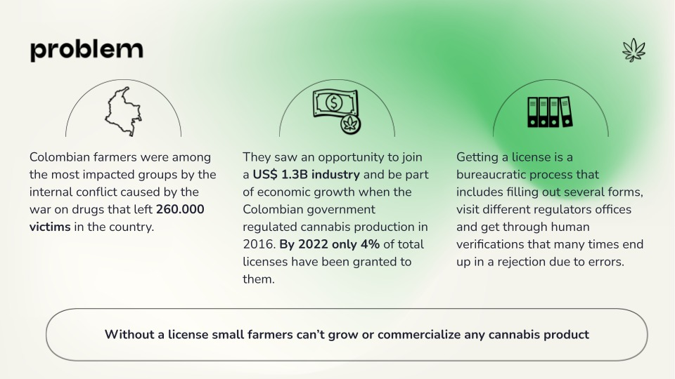
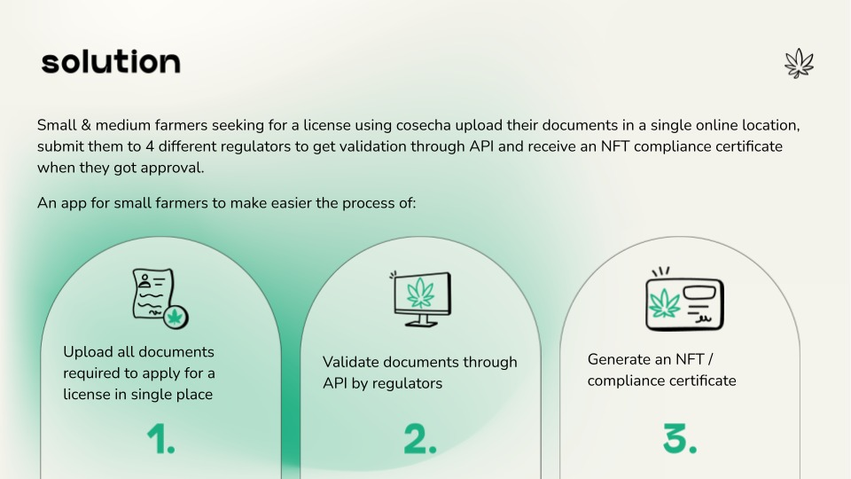

#  Cosecha

Accelerating colombian farmers entry to the cannabis industry through blockchain validation.

     
    
     

## Relevant links

| What? | Link |
|---|---|
| StarkNet contract address | https://goerli.voyager.online/contract/0x06d7ef2609d14ff261040ac30c82b5627f58cbb26ec057bef23cbebbd2c95326#writeContract |
| Landing Page | https://www.figma.com/proto/gipiEHPom58Bpw6pHrm1aM/ETH?embed_host=share&kind=&node-id=1%3A24&page-id=0%3A1&scaling=min-zoom&starting-point-node-id=1%3A24&viewport=2759%2C1739%2C0.41 |
| Subgraph | https://thegraph.com/hosted-service/subgraph/haycarlitos/cosecha |
| Slides | https://docs.google.com/presentation/d/1Qb0-Adhl0tIcPKPKoDu0FZ8MHMeseHcDzMIjF6Ov7z8/edit#slide=id.g1415a9c1b34_0_15 |

     
    
     

     
    
     

## Lógica del smart contract en StarkNet

### Core
1. Inicialización del contrato. 
   1. El constructor no tiene inputs. 
   2. Se inicializan `ERC721.initializer(name, symbol)` y `Ownable.initializer(owner)`. Se guarda un 0 en la en la storage variable `token_counter() -> (number: Uint256)`. 
2. El usuario puede llamar la variable external `register_yourself(application_number: felt: felt, name: felt, last_name: felt, id: felt) -> ()`. En el argumento register_number registra el número de registro de su aplicación, su nombre, su apellido y su cédula. Está información se guarda en un struct `UserInfo` con los members `application_number: felt, name, last_name, id_cedula, already_approved, licence_number, accepting_collaborations`. Inicialmente `already_approved, licence_number, accepting_collaborations` tienen un 0 pues el usuario se está registrando.
   1. Se escribe en la storage variable `address_to_user_info(address: felt) -> (user_info: UserInfo)` la información que el usuario envia.
   2. Se crea la storage variable `tokenID_to_user(tokenID: Uint256) -> (address: felt)` y el getter `get_user_from_tokenID(tokenID: Uint256) -> (address: felt)`. 
   3. Se suma 1 a la storage variable `token_counter.write(new_token)`.
   4. Se llama `ERC721._mint(to=caller, token_id=new_tokenID)`. Con esto el usuario se vuelve owner del equivalente a un collectible en su billetera.
3. Una vez que el usuario tenga la licencia aprobada puede llamar la variable external `got_my_license_approved(licence_number: felt, accepting_collaborations: felt)`. Primero se revisa que en efecto este usuario ya esté registrado, sino devuelve error. Está función registra en el struct `UserInfo.already_approved` y en `UserInfo.accepting_collaborations` un 1 y en `UserInfo.license_number` el numero de la licencia nueva.  
4. Con el getter `get_user_info(address: felt) -> (info: UserInfo)` se puede obtener la información del usuario. Para simplicidad, el getter `get_already_approved(address: felt) -> (is_approved: felt, is_collaborating: felt)` indica si el usuario ya fue aprobado para operar y si acepta colaboraciones.

### TODO
5. Capacidad de inicializar un documento indicando el sitio en IPFS donde se encuentra.
6. Se llama la función, who_collaborating() -> (len: felt, users_collaborating: felt*) para leer una storage variable donde se mantienen los usuarios que aceptan colaborar.
